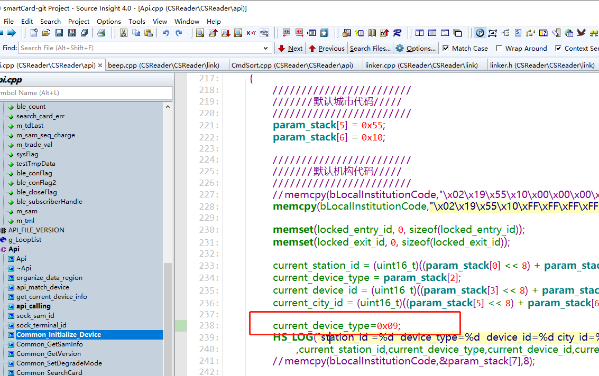
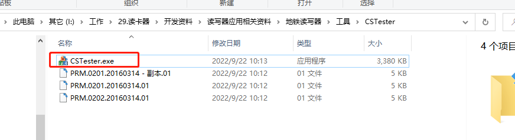
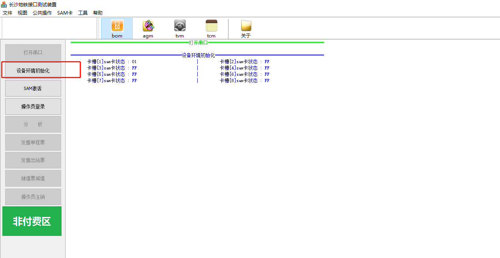
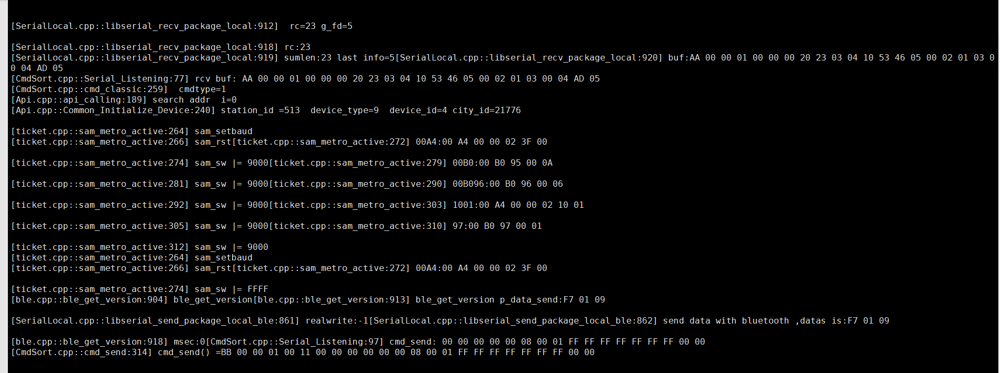
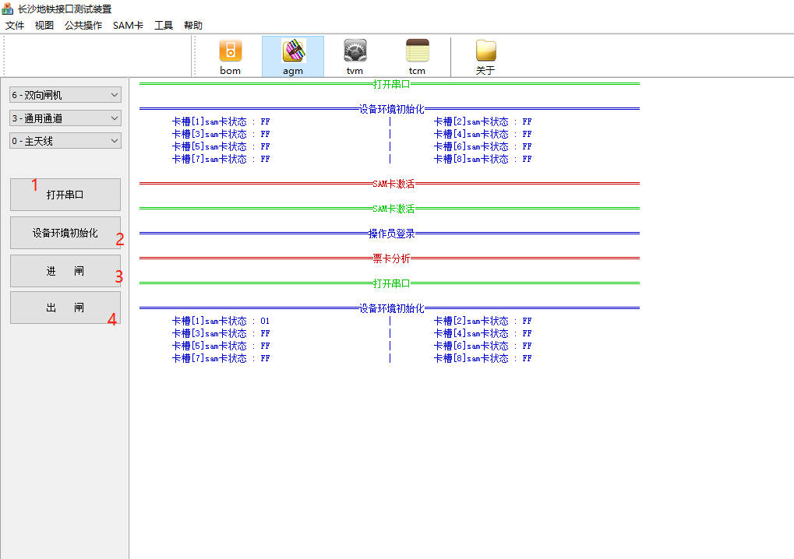
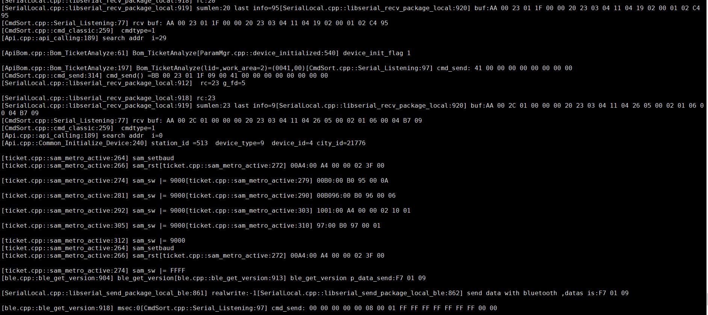
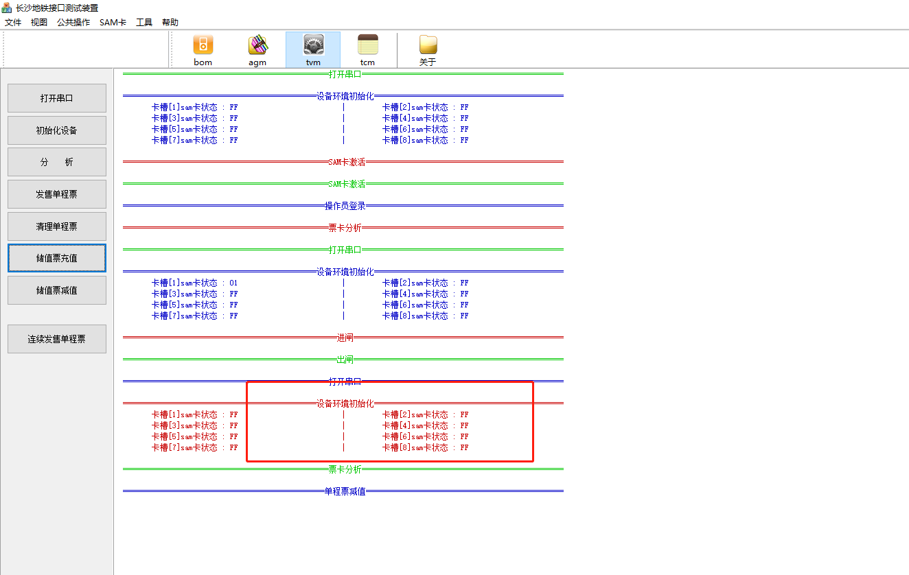
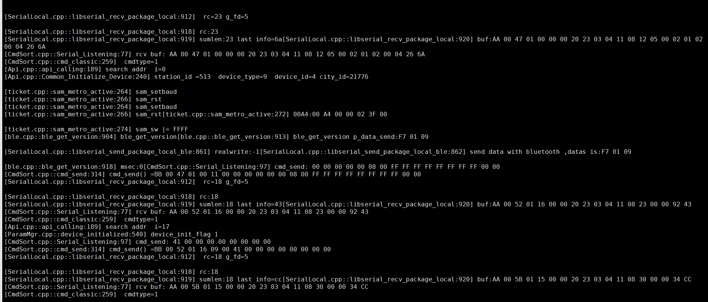
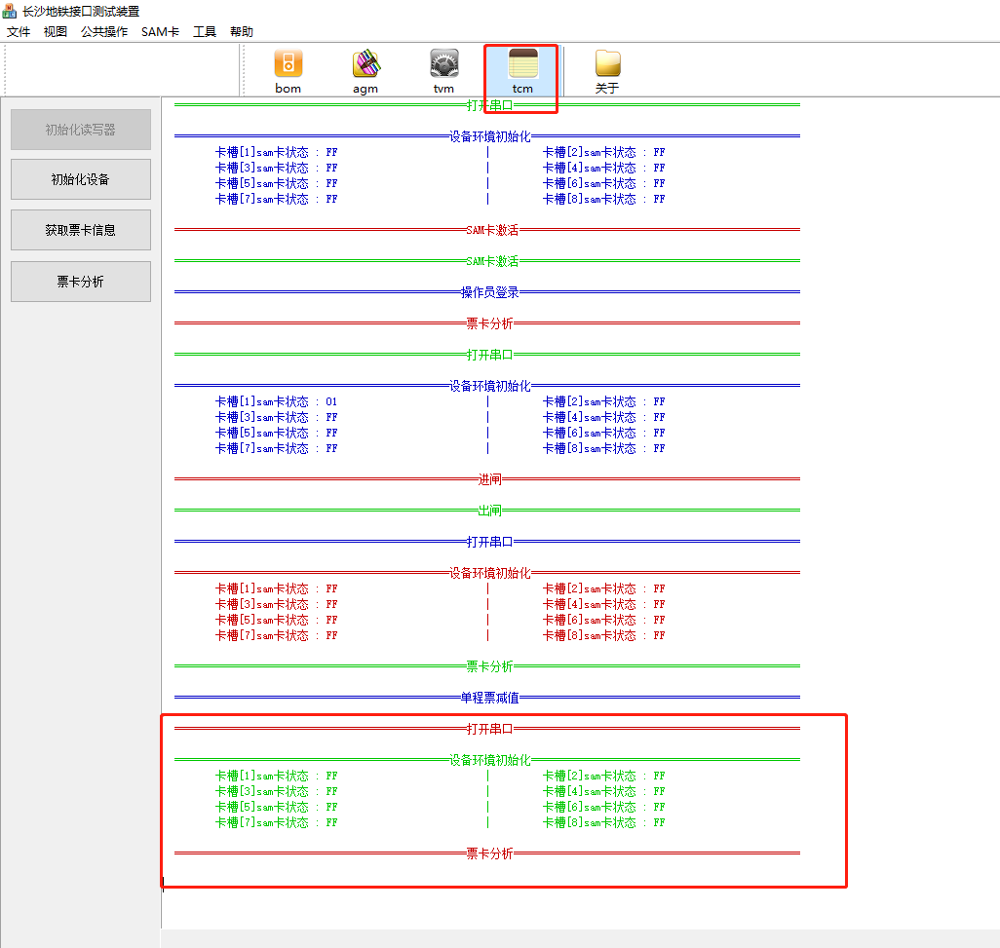
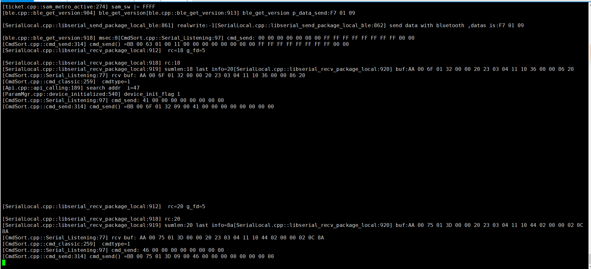

# 1、开发板测试记录

## 1、修改CSReader源码

测试日期：2023-03-04

修改内容：

current_device_type=0x09;

测试软件CSTester(未修改版本)：

测试结果截图：

### 1、bom->环境初始化

CSTeseter:

CSReader打印信息：

### 2、agm->环境初始化

CSTeseter:

CSReader打印信息:

### 3、tvm->环境初始化

CSTeseter:

CSReader打印信息:

### 4、tcm->环境初始化

CSTeseter:

CSReader打印信息:

