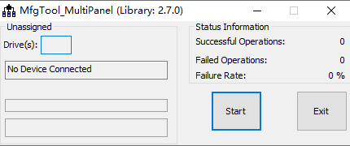
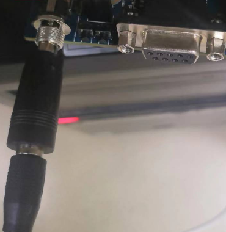
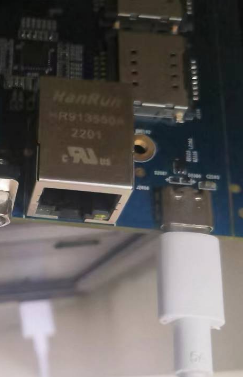
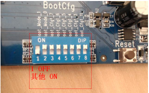
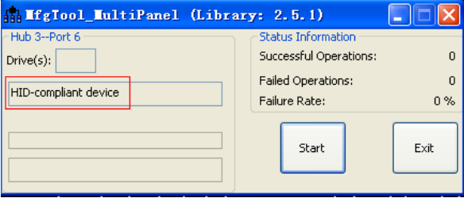
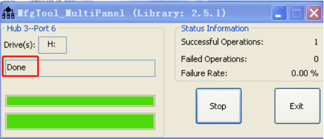
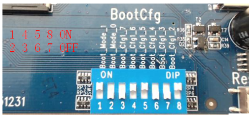

# 1、升级说明

## 1、运行工具

​	双击mfgtool2-yocto-mx-evk-emmc.vbs

## 2、板子准备

**1、连接12V电源供电，如下图所示：**

**2、插入USB OTG线，如下图所示：**

**3、拨码开关，拨码开关设置为 1 OFF， 2 为 ON，其他状态任意  ：**

**4、板子上电，启动板子烧写**

## 3、烧写

**1、烧写开始**

按照上述步骤后，工具检测出HID-compliant deivce,点击按钮“Start”,进行程序烧写。中间弹出格式化对话框，不管它，直到烧写完成。  

**2、烧写完成**

等待烧写完成，出现Done关键字，即可完成烧写，依次点击按钮“Stop”,按钮“Exit”。

**3、重新上电**

将电源断开，将拨码开关 拨到 1、 4、 5、 8 均为 on， 2、 3、 6、 7 均为 off，重新上电，板子正常启动。

