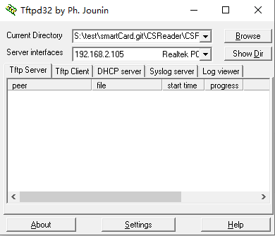
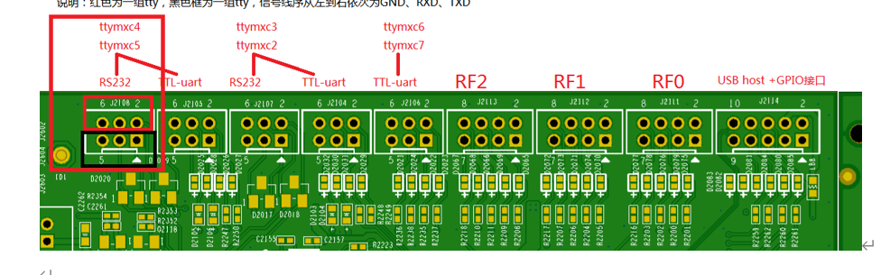
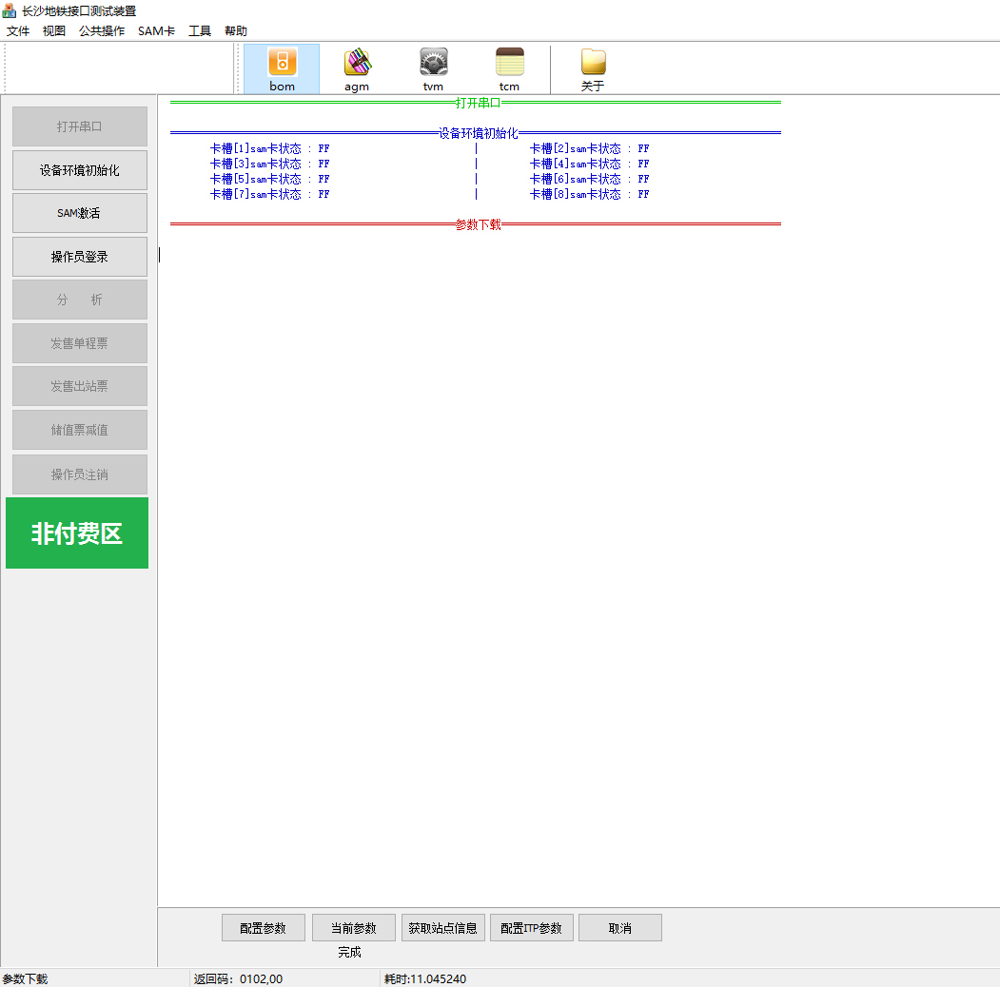

# 1、开发环境搭建

交叉编译工具：I:\工作\29.读卡器\开发资料\OKMX6UL-C(eMMC、NAND 版)_Qt5.6+Linux4.1.15用户资料-2020.01.04\工具\fsl-imx-x11-glibc-x86_64-meta-toolchain-qt5-cortexa7hf-neon-toolchain-4.1.15-2.0.0.sh


参考文档：I:\工作\29.读卡器\开发资料\OKMX6UL-C(eMMC、NAND 版)_Qt5.6+Linux4.1.15用户资料-2020.01.04\手册\OKMX6UL-C_Qt5.6+linux4.1.15软件手册_V1.2_2019.12.24.pdf


文档4.2章说明如何安装交叉编译工具链：./fsl-imx-x11-glibc-x86_64-meta-toolchain-qt5-cortexa7hf-neon-toolchain-4.1.15-2.0.0.sh  


**注意：**每次再编译程序前需要配置交叉变量环境

```shell
. /opt/fsl-imx-x11/4.1.15-2.0.0/environment-setup-cortexa7hf-neon-poky-linux-gnueabi  
```


**测试**：

```shell
quange@quange-VirtualBox:~/Work/test/smartCard/test$ arm-poky-linux-gnueabi-gcc -v
Using built-in specs.
COLLECT_GCC=arm-poky-linux-gnueabi-gcc
COLLECT_LTO_WRAPPER=/opt/fsl-imx-x11/4.1.15-2.0.0/sysroots/x86_64-pokysdk-linux/usr/libexec/arm-poky-linux-gnueabi/gcc/arm-poky-linux-gnueabi/5.3.0/lto-wrapper
Target: arm-poky-linux-gnueabi
Thread model: posix
gcc version 5.3.0 (GCC)
```


## 0、板子环境搭建：

### CSReader 编译测试：

进入目录quange@quange-VirtualBox:~/Work/test/smartCard.git/CSReader/CSReader：

运行指令

```shell
. /opt/fsl-imx-x11/4.1.15-2.0.0/environment-setup-cortexa7hf-neon-poky-linux-gnueabi 
make
```


执行文件：

```sh
quange@quange-VirtualBox:~/Work/test/smartCard.git/CSReader/CSReader$ ls CSReader -alh
-rwxr-xr-x 1 quange quange 735K 3月   4 10:41 CSReader

```

搭建tftp服务器：




### CSReader 运行：

初始化驱动相关：

```shell
root@imx6ulevk:~# cd /lib/modules/4.1.15-00025-gc980b04  
root@imx6ulevk:/lib/modules/4.1.15-00025-gc980b04#./S80insmod.sh
```

拷贝执行文件到板子上

```shell
root@imx6ulevk:/test/work# tftp -r CSReader -g 192.168.2.105
root@imx6ulevk:/test/work# chmod 777 CSReader 
root@imx6ulevk:/test/work# ./CSReader
```


## 1、编译samrtcard源码


### 1、带libgsserial.a编译

```shell
##############################################################################################
#
#       !!!! Do NOT edit this makefile with an editor which replace tabs by spaces !!!!    
#
##############################################################################################
# 
# On command line:
#
# make  = Create project
# make clean = Clean project files.
# To rebuild project do "make clean" and "make ".
# VERSION:1.0.0
#
#list all the cross compile
#CROSS			=arm-poky-linux-gnueabi-gcc--sysroot=/opt/fsl-imx-x11/4.1.15-2.0.0/sysroots/cortexa7hf-neon-poky-linux-gnueabi/usr/include-
#CROSS			= /opt/fsl-imx-x11/4.1.15-2.0.0/sysroots/x86_64-pokysdk-linux/usr/bin/arm-poky-linux-gnueabi/arm-poky-linux-gnueabi-

# CC				= $(CROSS)gcc
# CXX				= $(CROSS)g++
# AR				= $(CROSS)ar

#CC  		   := $(CC)
#LD  		   := $(LD)
#AR  		   := $(AR)
#CXX		   := $(CXX)
#CPP		   := $(CPP)
#AS		   := $(AS)

#RANLIB			= $(CROSS)ranlib
# CXXFLAGS		= -O1 -s --sysroot=/opt/fsl-imx-x11/4.1.15-2.0.0/sysroots/cortexa7hf-neon-poky-linux-gnueabi/ -march=armv7ve -mfpu=neon  -mfloat-abi=hard -mcpu=cortex-a7 
CXXFLAGS		= -O1 -s 
LDFLAGS			= api/libgsserial.a	 #
#target out put bin name
APP_NAME		= CSReader
SDK_DIR			= /opt/fsl-imx-x11/4.1.15-2.0.0/sysroots/x86_64-pokysdk-linux/usr/lib/arm-poky-linux-gnueabi/gcc/arm-poky-linux-gnueabi/5.3.0/include/
#list incluce head files directory
SDK_INC_DIR 	= -I so_h  -I software
#list include libs directory
sdkExtendLibDir	= so

# List cpp source files here 
SRC_PATH		= software


#expand cpp source files 
SRC-y 			:= $(wildcard api/*.cpp) $(wildcard link/*.cpp) $(wildcard main.cpp) $(wildcard json/*.cpp) $(wildcard ble/*.cpp)

#define object files ,no need modify					
OBJDIR			= Release
OBJS			= $(patsubst %.cpp, $(OBJDIR)/%.o, $(SRC-y))
#define depend files

DEPS			=$(OBJS:%.o=%.d)
 
# List all user libraries here
ULIBS			= -lpthread
#

MYDLLS 			+= -L $(sdkExtendLibDir)

SDK_LIB 		= $(MYDLLS) $(ULIBS)


	
##############################################################################################
# makefile rules
##############################################################################################	
$(APP_NAME):	$(OBJS)
	@echo ""
	@echo "+---------------------------------------------------"
	@echo "|"
	@echo "|   building target: $(APP_NAME)"
	@echo "|"
	@echo "+---------------------------------------------------"
	$(CXX)  $(OBJS) $(LDFLAGS) -o $(APP_NAME) $(SDK_INC_DIR) $(SDK_LIB)
	@echo ""
	@echo "+---------------------------------------------------"
	@echo "|"
	@echo "|   Finished building target: $(APP_NAME)"
	@echo "|"
	@echo "+---------------------------------------------------"

$(OBJS):	$(OBJDIR)/%.o : %.cpp
	$(CXX) -c $(SDK_INC_DIR) $(CXXFLAGS)  $< -o $@
	
$(DEPS):	$(OBJDIR)/%.d :	%.cpp #
	@[ -d $(dir $@) ] || mkdir -p $(dir $@)
	@set -e; rm -f $@; \
	$(CXX) -MM  $<  $(SDK_INC_DIR) > $@.$$$$; \
	sed 's\[a-zA-Z0-9_-]*.o:\$(OBJDIR)/$*.o:\g' < $@.$$$$ > $@;\
	rm -f $@.$$$$

-include $(DEPS)#

.PHONY: clean
clean:
	@rm -vf $(APP_NAME)  *~ *.gdb $(OBJS) $(DEPS)


```

直接执行make


### 2、不带libgsserial.a编译

屏蔽上述的LDFLAGS			= api/libgsserial.a	 

并且将相关接口替换

```shell
libserial_init ->libserial_init_local
libserial_send_package	->libserial_recv_package_local
libserial_recv_package ->libserial_send_package_local
```

直接执行make


### 3、流程分析

#### 1、初始化射频设备(rf531dev0)

```c++
int rfdev_init(void)
{
	int nresult=-1;
	g_hostreader = open("/dev/rf531dev0", O_RDWR);
	if (g_hostreader > 0)
	{
		nresult = 0;
	}
	return nresult;
}
```


#### 2、初始化sam设备(samdev0)

```c++
int samdev_init(void)
{
    int nresult=-1;
    g_hostsam = open("/dev/samdev0", O_RDWR);
    if (g_hostsam > 0)
    {
    	nresult = 0;
    }
    return nresult;
}
init_sam_inf();//初始化SAM全局信息

```


#### 3、线程单独循环接受BOM机串口数据

串口接线：COM4->ttymxc4



接收到的数据存放公共缓存区 Api::qr_readbuf

```c++
pthread_create(&thrd1,NULL,FunMonitorQR,NULL);s
void *FunMonitorQR(void *ptr)
{
	//dbg_formatvar("FunMonitorQR");
	CmdSort cmd1;
	cmd1.Serial_ListeningQR();
	usleep(100);
    return NULL;
}

int CmdSort::Serial_ListeningQR()
{
	int received					= 0;
	uint8_t readbuf[SIZE_MAX_RECV_QR]  = {0};
	uint8_t databuf[SIZE_MAX_RECV_QR]	= {0};
	uint16_t len_data				= 0;

	#ifdef _TERMINAL_BOM
	if ((libserial_init_local((char *)COM4, 115200, 8, 'N', 1, 0, 0)) > 0)
	{
		//dbg_formatvar("libserial_init_local");
		ubeep(100);
	}
	#else
	if ((libserial_init_local((char *)COM3, 115200, 8, 'N', 1, 0, 0)) > 0)
	{
		//dbg_formatvar("libserial_init_local");
		ubeep(100);
	}
	#endif


	while(m_flag_app_run)
	{
		memset(readbuf, 0, SIZE_MAX_RECV_QR);
		memset(databuf, 0, SIZE_MAX_RECV_QR);
		received = libserial_recv_package_local(SIZE_MAX_RECV_QR, 5, readbuf);
		//dbg_formatvar("received:%d",received);
		if (received > 0)
		{
			Api::qr_readbuf[0] = 0x51;
			Api::qr_readbuf[1] = 0x52;

			//memcpy(&Api::qr_readbuf[2], readbuf, received+2);
			//加上时间戳用来去除掉无效的刷码
			memcpy(&Api::qr_readbuf[2], CmdSort::m_time_now, 7);
			memcpy(&Api::qr_readbuf[9], readbuf, received+2);
			Api::qr_readbuf_len = received;
			//dbg_dumpmemory("qr_readbuf:", Api::qr_readbuf, received+9);
			//g_Record.log_buffer("qr_readbuf:", Api::qr_readbuf, received+9);
		}
		usleep(50 * 1000);
	}

	return 0;
}
```


#### 4、串口监听（主进程阻塞,循环监听并处理）


数据码接收，交给cmd_classic(readbuf, databuf, len_data)处理，根据不同的码，做不同处理

```c++
cmd.Serial_Listening();
int CmdSort::Serial_Listening()
{
	int received					= 0;
	uint8_t readbuf[SIZE_MAX_RECV]  = {0};
	uint8_t databuf[SIZE_MAX_RECV]	= {0};
	uint16_t len_data				= 0;

	if ((libserial_init_local((char *)COM1, 115200, 8, 'N', 1, 0, 0)) > 0)
	{
		//dbg_formatvar("libserial_init_COM1");
		ubeep(100);
	}

	//dbg_formatvar("libserial_init");

	while(m_flag_app_run)
	{
		memset(readbuf, 0, SIZE_MAX_RECV);
		memset(databuf, 0, SIZE_MAX_RECV);
		received = libserial_recv_package_local(SIZE_MAX_RECV, 5, readbuf);

		if (received > 0)
		{
			// 如果设备每天都没有重新初始化读写器,那么读写器必须自行清理过期数据
			if (memcmp(m_time_now, readbuf + 7, 4) != 0)
			{
				memcpy(m_time_now, readbuf + 7, 7);
				g_Record.delete_file_overdue();
			}
			else
			{
				memcpy(m_time_now, readbuf + 7, 7);
			}

			memcpy(Api::get_package_time, m_time_now, 7);//记录下被调用接口的时间

			m_antenna_mode = readbuf[6] & 0x03;

			cmd_classic(readbuf, databuf, len_data);//数据码解析，并构造新的码
			if (len_data > 0)
			{
				cmd_send(readbuf, databuf, len_data);
			}

			if (m_sys_reboot)
			{
				sync(); // 同步磁盘数据,将缓存数据回写到硬盘,以防数据丢失[luther.gliethttp]
				reboot(RB_AUTOBOOT);
			}
		}
	}

	return 0;
}
```


### 4、数据码交互分析


#### 1、COMMAND_A

各种响应码处理：包括boom agm tvm tcm机器

主处理函数：Api::api_calling


##### 0、COMM初始化


##### 1、Common_Initialize_Device


1、获取注册的设备信息，跟查找配置的车站列表是否存在


```c++
////////////////////////
///////默认城市代码/////
//////param_stack 串口传入的参数//////////////////
param_stack[5] = 0x55;
param_stack[6] = 0x10;

current_station_id = (uint16_t)((param_stack[0] << 8) + param_stack[1]);//station_id 设备状态
current_device_type = param_stack[2];//device_type 设备类型
current_device_id = (uint16_t)((param_stack[3] << 8) + param_stack[4]);//device_id 设备ID
current_city_id = (uint16_t)((param_stack[5] << 8) + param_stack[6]);//city_id 城市ID

TicketBase::load_confirm_from_file();//加载Confirm.his文件 ？？？ 目前没有找到该文件,也可能动态保存的（Ticket相关）
```


##### 1、BOOM机


###### 1、boom登录


1.判断是否设备初始化（Common_Initialize_Device函数初始化设备）

2、


##### 2、AGM机


##### 3、TVM机


##### 4、TCM机


#### 2、COMMAND_B

普通文件下载

Download dl;
主处理函数：dl.file_mgr(p_cmd_recved, p_data_to_send, lentosend);

#### 3、COMMAND_C

itp文件下载

Download dl;
主处理函数：dl.file_mgr_itp(p_cmd_recved, p_data_to_send, lentosend);

#### 4、COMMAND_D

调试debug使用

主处理函数：InnerDebug::debug_calling(p_cmd_recved[4], p_cmd_recved + 16, p_data_to_send, lentosend, app_valid);


# 2、文档接收记录


## 1、接收xxx的SVN上全部资料

存放路径：I:\工作\29.读卡器\开发资料\读写器应用相关资料\地铁读写器

CSTester源码路径：I:\工作\29.读卡器\开发资料\读写器应用相关资料\地铁读写器\代码\CSTester


## 2、接收长沙读卡器资料

存放路径：I:\工作\29.读卡器\开发资料\长沙读卡器资料


## 3、接收调试资料

存放路径：I:\工作\29.读卡器\开发资料\读写器应用相关资料\地铁读写器\文档\调试说明文件.docx


# 3、问题解决记录：


## 1、射频节点驱动（/dev/rf531dev0）

```
root@imx6ulevk:/test# cd /lib/modules/4.1.15-00025-gc980b04/  
root@imx6ulevk:/lib/modules/4.1.15-00025-gc980b04# insmod miscsam.ko
root@imx6ulevk:/lib/modules/4.1.15-00025-gc980b04# insmod miscnfc.ko
```


## 2、串口测试

目前测试过ttymxc1可以用（直接连接串口线），ttymxc4/5不行。

需要使用COM1连接电脑 ln -s /dev/ttymxc1 /dev/ttyS0


## 3、beep问题

insmod miscbeep.ko 后，调用相关的函数Beep_Sleep()、ubeep()需要等待很久

目前解决方法：

rmmod miscbeep

后续再更新驱动

## 4、Serial_Listening问题

同时运行pthread_create(&thrd1,NULL,FunMonitorQR,NULL);与cmd.Serial_Listening();，会导致Serial_Listening读取串口数据异常。调试时需要屏蔽。

同时运行cmd_ble.Serial_ListeningBLE(115200)与cmd.Serial_Listening()不会。


## 5、sam激活问题：

device_initialized device_init_flag 0

设备未初始化。需要先初始化

在函数Common_Initialize_Device中g_Parameter.device_initialize();


## 6、参数下载问题：

**1、CSTester端：**

公共操作->设备参数->配置参数

需要加大CSTester->Serial.cpp延时,否则会出现通信超时，导致无法完成下一步

```c++
Serial::Serial(void)
{
	m_bOpen = false;
	memset(&m_comStat, 0, sizeof(m_comStat));
	m_dwTimeOut = 20000;
}
```


正确下载如图所示：返回值不是0xFFFF




**2、CSReader端:**

需要删除原来的文件

```shell
root@imx6ulevk:/test/work# rm  Tmp/PRM.0201.20160314.01
```

新建文件夹：

```shell
root@imx6ulevk:/test/work# mkdir ParamFolder
```

否则ParamMgr::config_param函数种rename会跳出报错。


数据写入到m_prm_config全局变量中，并保存在文件 PrmConfig.dat

```shell
root@imx6ulevk:/test/work# cat PrmConfig.dat 
0201:PRM.0201.20160314.01
```


**3、遗留问题：**

在Common_Initialize_Device中，会判断设备类型current_device_type，**只有设备9**才会跳过参数检查，直接进入设备初始化环节。

（bom:3 ;agm:4~6可选；tvm:2 ;tcm:7）

```c++
if (current_device_type != 0x09)
{
    ret.wErrCode = g_Parameter.load_all_prms();
    HS_LOG("wErrCode =%d\n",ret.wErrCode);
    if (ret.wErrCode != 0)	break;

    ret.wErrCode = g_Parameter.device_registed(current_station_id, current_device_type, current_device_id);
    HS_LOG("wErrCode =%d\n",ret.wErrCode);
    if (ret.wErrCode != 0)	break;

    TicketBase::load_confirm_from_file();
}
```

常规类型，会进入参数判断（所有参数进行检查一遍，**目前是缺少很多参数文件**）

```c++
g_Parameter.load_all_prms()->prm_config_unison->m_prm_for_reader(遍历所有PRM参数，判断是否加载)//目前只有参数文件PRM.0201.20160314.01
//判断成功后，才会读取m_prm_config配置的数据。
```


强制的将（所有）设备类型改成0x9（目前是修改了CSTester的类型）


bom机可以运行：


5、sam激活问题：